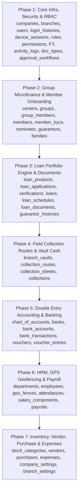

# Enterprise Database Architecture Specification
## Project: Grihalaxmi Finance ERP Pro
**Framework:** Laravel 12 | **PHP:** 8.2 | **Database:** MySQL 8.0+ (InnoDB Engine)

---

## Architectural Overview & Design Principles

1. **Third Normal Form (3NF) Compliance:** Strictly normalized to eliminate data redundancy and insertion/deletion anomalies.
2. **Financial Precision:** All monetary amounts use `DECIMAL(18,4)` to eliminate floating-point rounding errors.
3. **Multi-Tenancy & Spatial Hierarchy:** Core tables enforce explicit `company_id` and `branch_id` foreign keys for tenant-level and branch-level scope isolation.
4. **Group Lending Engine (JLG / SHG Support):** Hierarchical Center $\rightarrow$ Group $\rightarrow$ Member architecture for joint liability microfinance.
5. **UUID Support for Transactional Integrity:** All financial and transactional tables include an indexed `uuid` (`CHAR(36) UNIQUE`) to facilitate distributed offline sync (Flutter Mobile App), REST API identification, and secure multi-tenant SaaS routing.
6. **Auditability & Compliance:** Every operational entity incorporates standardized audit trail columns (`created_by`, `updated_by`, `deleted_by`, `created_at`, `updated_at`, `deleted_at`).
7. **System-wide Workflow Engine:** Generic polymorphic schema for Document Attachments (`attachments`), Status Histories (`status_histories`), and Multi-level Approvals (`approval_workflows`, `approval_workflow_steps`, `approval_requests`, `approval_histories`).

---

## Common Global Schema Standards

Every transactional and master table includes:
- **`id`**: `BIGINT UNSIGNED AUTO_INCREMENT PRIMARY KEY`
- **`company_id`**: `BIGINT UNSIGNED NOT NULL FOREIGN KEY -> companies(id)`
- **`branch_id`**: `BIGINT UNSIGNED NULLABLE FOREIGN KEY -> branches(id)`
- **`created_by`**: `BIGINT UNSIGNED NULLABLE FOREIGN KEY -> users(id)`
- **`updated_by`**: `BIGINT UNSIGNED NULLABLE FOREIGN KEY -> users(id)`
- **`deleted_by`**: `BIGINT UNSIGNED NULLABLE FOREIGN KEY -> users(id)`
- **`created_at`**: `TIMESTAMP DEFAULT CURRENT_TIMESTAMP`
- **`updated_at`**: `TIMESTAMP DEFAULT CURRENT_TIMESTAMP ON UPDATE CURRENT_TIMESTAMP`
- **`deleted_at`**: `TIMESTAMP NULLABLE` (Soft Delete)

---

## Global System & Foundation Infrastructure (Core Tables)

### Table 1: `companies`
- **Purpose:** Multi-company head office enterprise records.
- **Columns:** `id`, `name` (VARCHAR(150)), `code` (VARCHAR(20), UNIQUE), `registration_number` (VARCHAR(50)), `tax_id` (VARCHAR(50)), `email` (VARCHAR(100)), `phone` (VARCHAR(20)), `address` (TEXT), `currency_code` (VARCHAR(10), DEFAULT 'INR'), `currency_symbol` (VARCHAR(5), DEFAULT '₹'), `logo_path` (VARCHAR(255)), `is_active` (TINYINT(1), DEFAULT 1), audit fields (`created_by`, `updated_by`, `deleted_by`, `created_at`, `updated_at`, `deleted_at`).

### Table 2: `branches`
- **Purpose:** Branch network locations, vault limits, and regional hierarchy.
- **Columns:** `id`, `company_id` (FK -> `companies.id`), `name` (VARCHAR(150)), `code` (VARCHAR(20)), `manager_id` (FK -> `users.id`, NULLABLE), `email` (VARCHAR(100)), `phone` (VARCHAR(20)), `address` (TEXT), `city` (VARCHAR(50)), `state` (VARCHAR(50)), `pincode` (VARCHAR(10)), `vault_cash_limit` (DECIMAL(18,4), DEFAULT 0.0000), `current_vault_balance` (DECIMAL(18,4), DEFAULT 0.0000), `is_active` (TINYINT(1), DEFAULT 1), audit fields.

### Table 3: `users`
- **Purpose:** Central staff authentication, branch binding, and credential management.
- **Columns:** `id`, `company_id` (FK -> `companies.id`), `branch_id` (FK -> `branches.id`, NULLABLE), `name` (VARCHAR(100)), `email` (VARCHAR(100), UNIQUE), `phone` (VARCHAR(20), UNIQUE, NULLABLE), `password` (VARCHAR(255)), `user_type` (ENUM('super_admin', 'company_admin', 'branch_manager', 'staff'), DEFAULT 'staff'), `is_active` (TINYINT(1), DEFAULT 1), `remember_token`, `email_verified_at`, audit fields.

### Table 4: `login_histories`
- **Purpose:** Security audit log tracking user authentication attempts, IP addresses, and devices.
- **Columns:** `id`, `user_id` (FK -> `users.id`), `ip_address` (VARCHAR(45)), `user_agent` (TEXT), `device_type` (VARCHAR(50)), `status` (ENUM('success', 'failed')), `login_at` (TIMESTAMP DEFAULT CURRENT_TIMESTAMP), `logout_at` (TIMESTAMP, NULLABLE).

### Table 5: `device_sessions`
- **Purpose:** Active FCM push tokens, Flutter mobile app sessions, and single sign-on device locks.
- **Columns:** `id`, `user_id` (FK -> `users.id`), `device_name` (VARCHAR(100)), `device_token_fcm` (TEXT, NULLABLE), `session_token` (VARCHAR(255), UNIQUE), `ip_address` (VARCHAR(45)), `last_activity_at` (TIMESTAMP).

### Table 6: `roles` (Spatie RBAC)
- **Columns:** `id`, `name`, `guard_name`, `created_at`, `updated_at`

### Table 7: `permissions` (Spatie RBAC)
- **Columns:** `id`, `name`, `guard_name`, `created_at`, `updated_at`

### Table 8: `model_has_roles` (Spatie RBAC)
- **Columns:** `role_id`, `model_type`, `model_id`

### Table 9: `model_has_permissions` (Spatie RBAC)
- **Columns:** `permission_id`, `model_type`, `model_id`

### Table 10: `role_has_permissions` (Spatie RBAC)
- **Columns:** `permission_id`, `role_id`

### Table 11: `financial_years`
- **Purpose:** Accounting period locks and fiscal cycle governance.
- **Columns:** `id`, `company_id` (FK -> `companies.id`), `title` (VARCHAR(50)), `start_date` (DATE), `end_date` (DATE), `is_closed` (TINYINT(1), DEFAULT 0), audit fields.

### Table 12: `activity_logs`
- **Purpose:** Compliance audit trail tracking all mutating user actions.
- **Columns:** `id`, `company_id` (FK -> `companies.id`), `branch_id` (FK -> `branches.id`), `user_id` (FK -> `users.id`), `event` (VARCHAR(50)), `auditable_type` (VARCHAR(150)), `auditable_id` (BIGINT UNSIGNED), `old_values` (JSON), `new_values` (JSON), `ip_address` (VARCHAR(45)), `user_agent` (TEXT), `created_at`.

### Table 13: `document_types`
- **Purpose:** Master registry of mandatory and optional document proofs across modules.
- **Columns:** `id`, `company_id` (FK -> `companies.id`), `code` (VARCHAR(30), UNIQUE), `name` (VARCHAR(100)), `module` (ENUM('member', 'loan', 'employee', 'vendor')), `is_mandatory` (TINYINT(1), DEFAULT 0), audit fields.

### Table 14: `attachments`
- **Purpose:** Universal document & media attachment storage engine.
- **Columns:** `id`, `company_id` (FK -> `companies.id`), `attachable_type` (VARCHAR(150)), `attachable_id` (BIGINT UNSIGNED), `document_type_id` (FK -> `document_types.id`, NULLABLE), `file_title` (VARCHAR(150)), `file_path` (VARCHAR(255)), `file_size_kb` (INT UNSIGNED), `mime_type` (VARCHAR(100)), audit fields.

### Table 15: `status_histories`
- **Purpose:** Tracks lifecycle status progression for loans, applications, purchases, and leaves.
- **Columns:** `id`, `statusable_type` (VARCHAR(150)), `statusable_id` (BIGINT UNSIGNED), `from_status` (VARCHAR(50)), `to_status` (VARCHAR(50)), `remarks` (TEXT), `changed_by` (FK -> `users.id`), `created_at`.

### Table 16: `approval_workflows`
- **Purpose:** Configurable multi-tier approval rules by module and amount limits.
- **Columns:** `id`, `company_id` (FK -> `companies.id`), `module` (VARCHAR(50)), `name` (VARCHAR(100)), `min_amount` (DECIMAL(18,4), DEFAULT 0.0000), `max_amount` (DECIMAL(18,4), DEFAULT 999999999.0000), `is_active` (TINYINT(1), DEFAULT 1), audit fields.

### Table 17: `approval_workflow_steps`
- **Columns:** `id`, `approval_workflow_id` (FK -> `approval_workflows.id`), `step_number` (INT UNSIGNED), `approver_role_id` (FK -> `roles.id`, NULLABLE), `approver_user_id` (FK -> `users.id`, NULLABLE), `created_at`, `updated_at`.

### Table 18: `approval_requests`
- **Columns:** `id`, `approval_workflow_id` (FK -> `approval_workflows.id`), `approvable_type` (VARCHAR(150)), `approvable_id` (BIGINT UNSIGNED), `current_step` (INT UNSIGNED, DEFAULT 1), `status` (ENUM('pending', 'approved', 'rejected'), DEFAULT 'pending'), `comments` (TEXT), audit fields.

### Table 19: `approval_histories`
- **Purpose:** Detailed step-by-step audit record of each approval level decision.
- **Columns:** `id`, `approval_request_id` (FK -> `approval_requests.id`), `step_number` (INT UNSIGNED), `approver_id` (FK -> `users.id`), `action` (ENUM('approved', 'rejected', 'escalated')), `comments` (TEXT), `action_at` (TIMESTAMP DEFAULT CURRENT_TIMESTAMP).

---

## 15 FINAL MODULE DATABASE SPECIFICATIONS

---

### Module 1: Dashboard
- **Module Purpose:** Real-time KPI widget caching, executive metric aggregation, and customized user dashboard layouts.
- **Tables:**

#### Table 20: `dashboard_widgets`
- **Columns:** `id`, `code` (VARCHAR(50), UNIQUE), `title` (VARCHAR(100)), `module` (VARCHAR(50)), `is_active` (TINYINT(1)), `created_at`, `updated_at`.

#### Table 21: `user_dashboard_layouts`
- **Columns:** `id`, `user_id` (FK -> `users.id`), `widget_id` (FK -> `dashboard_widgets.id`), `sort_order` (INT), `settings_json` (JSON), `created_at`, `updated_at`.

---

### Module 2: Branch Management
- **Module Purpose:** Manage branch locations, vault cash reserves, daily vault transactions, and performance targets.
- **Tables:**

#### Table 22: `branch_vaults`
- **Columns:** `id`, `company_id` (FK -> `companies.id`), `branch_id` (FK -> `branches.id`, UNIQUE), `opening_balance` (DECIMAL(18,4)), `current_balance` (DECIMAL(18,4)), `closing_balance` (DECIMAL(18,4)), audit fields.

#### Table 23: `branch_vault_transactions`
- **Columns:** `id`, `branch_vault_id` (FK -> `branch_vaults.id`), `transaction_type` (ENUM('deposit', 'withdrawal', 'transfer', 'disbursement', 'collection')), `amount` (DECIMAL(18,4)), `balance_after` (DECIMAL(18,4)), `reference_number` (VARCHAR(50)), `remarks` (TEXT), audit fields.

#### Table 24: `branch_targets`
- **Columns:** `id`, `branch_id` (FK -> `branches.id`), `target_month` (DATE), `target_loan_disbursement` (DECIMAL(18,4)), `target_collection_amount` (DECIMAL(18,4)), `target_new_members` (INT UNSIGNED), audit fields.

---

### Module 3: Member Management (Group Lending / JLG / SHG Support)
- **Module Purpose:** Complete borrower lifecycle onboarding, Centers, Groups (Joint Liability Groups), KYC verification, nominee assignment, family background, guarantor records, and QR Member ID generation.
- **Tables:**

#### Table 25: `centers` (Center Level for Group Microfinance)
- **Columns:** `id`, `company_id` (FK -> `companies.id`), `branch_id` (FK -> `branches.id`), `code` (VARCHAR(30), UNIQUE), `name` (VARCHAR(100)), `officer_id` (FK -> `users.id`, NULLABLE), `meeting_day` (ENUM('monday', 'tuesday', 'wednesday', 'thursday', 'friday', 'saturday', 'sunday')), `meeting_time` (TIME), `address` (TEXT), audit fields.

#### Table 26: `groups` (JLG / Self-Help Group)
- **Columns:** `id`, `center_id` (FK -> `centers.id`), `code` (VARCHAR(30), UNIQUE), `name` (VARCHAR(100)), `leader_member_id` (BIGINT UNSIGNED, NULLABLE), audit fields.

#### Table 27: `group_members`
- **Columns:** `id`, `group_id` (FK -> `groups.id`), `member_id` (BIGINT UNSIGNED), `role_in_group` (ENUM('leader', 'member'), DEFAULT 'member'), `joined_at` (DATE), audit fields.
- **Unique:** (`group_id`, `member_id`)

#### Table 28: `members`
- **Columns:** `id`, `company_id` (FK -> `companies.id`), `branch_id` (FK -> `branches.id`), `center_id` (FK -> `centers.id`, NULLABLE), `group_id` (FK -> `groups.id`, NULLABLE), `member_code` (VARCHAR(30), UNIQUE), `first_name` (VARCHAR(50)), `last_name` (VARCHAR(50)), `gender` (ENUM('male', 'female', 'other')), `dob` (DATE), `phone` (VARCHAR(20)), `email` (VARCHAR(100)), `address` (TEXT), `city` (VARCHAR(50)), `state` (VARCHAR(50)), `pincode` (VARCHAR(10)), `assigned_officer_id` (FK -> `users.id`, NULLABLE), `status` (ENUM('pending', 'active', 'suspended', 'closed'), DEFAULT 'pending'), `qr_code_path` (VARCHAR(255)), audit fields.

#### Table 29: `member_kycs`
- **Columns:** `id`, `member_id` (FK -> `members.id`), `id_type` (ENUM('aadhar', 'pan', 'voter_id', 'passport', 'ration_card')), `id_number` (VARCHAR(50)), `verified_at` (DATETIME), `verified_by` (FK -> `users.id`), audit fields.

#### Table 30: `member_nominees`
- **Columns:** `id`, `member_id` (FK -> `members.id`), `name` (VARCHAR(100)), `relationship` (VARCHAR(50)), `dob` (DATE), `phone` (VARCHAR(20)), `share_percentage` (DECIMAL(5,2)), audit fields.

#### Table 31: `member_guarantors`
- **Columns:** `id`, `member_id` (FK -> `members.id`), `name` (VARCHAR(100)), `phone` (VARCHAR(20)), `id_type` (VARCHAR(50)), `id_number` (VARCHAR(50)), `address` (TEXT), `occupation` (VARCHAR(100)), `monthly_income` (DECIMAL(18,4)), audit fields.

#### Table 32: `member_families`
- **Columns:** `id`, `member_id` (FK -> `members.id`), `father_spouse_name` (VARCHAR(100)), `family_members_count` (INT), `total_family_income` (DECIMAL(18,4)), `house_ownership` (ENUM('owned', 'rented', 'leased')), audit fields.

---

### Module 4: Loan Management
- **Module Purpose:** Loan scheme creation, interest logic, application processing, multi-level verification, approval, disbursement, installment schedule generator (Flat vs Reducing balance), penalties, loan documents, guarantor history, closures, renewals, and top-ups.
- **Tables:**

#### Table 33: `loan_products`
- **Columns:** `id`, `company_id` (FK -> `companies.id`), `name` (VARCHAR(100)), `code` (VARCHAR(20), UNIQUE), `interest_type` (ENUM('flat', 'reducing_balance')), `annual_interest_rate` (DECIMAL(8,4)), `min_amount` (DECIMAL(18,4)), `max_amount` (DECIMAL(18,4)), `min_tenure_months` (INT), `max_tenure_months` (INT), `repayment_frequency` (ENUM('daily', 'weekly', 'bi_weekly', 'monthly')), `processing_fee_percentage` (DECIMAL(5,2)), `penalty_rate_per_day` (DECIMAL(5,2)), `is_active` (TINYINT(1)), audit fields.

#### Table 34: `loan_applications`
- **Columns:** `id`, `uuid` (CHAR(36), UNIQUE, NOT NULL), `company_id` (FK -> `companies.id`), `branch_id` (FK -> `branches.id`), `center_id` (FK -> `centers.id`, NULLABLE), `group_id` (FK -> `groups.id`, NULLABLE), `member_id` (FK -> `members.id`), `loan_product_id` (FK -> `loan_products.id`), `application_number` (VARCHAR(30), UNIQUE), `applied_amount` (DECIMAL(18,4)), `applied_tenure_months` (INT), `purpose` (TEXT), `status` (ENUM('draft', 'applied', 'verified', 'approved', 'rejected', 'disbursed')), audit fields.

#### Table 35: `loan_verifications`
- **Columns:** `id`, `loan_application_id` (FK -> `loan_applications.id`), `verified_by` (FK -> `users.id`), `field_visit_done` (TINYINT(1)), `income_verified_amount` (DECIMAL(18,4)), `credit_score_notes` (TEXT), `recommendation` (ENUM('recommended', 'not_recommended')), audit fields.

#### Table 36: `loans` (Master Contract Table)
- **Columns:** `id`, `uuid` (CHAR(36), UNIQUE, NOT NULL), `company_id` (FK -> `companies.id`), `branch_id` (FK -> `branches.id`), `center_id` (FK -> `centers.id`, NULLABLE), `group_id` (FK -> `groups.id`, NULLABLE), `member_id` (FK -> `members.id`), `loan_product_id` (FK -> `loan_products.id`), `loan_application_id` (FK -> `loan_applications.id`), `loan_account_number` (VARCHAR(30), UNIQUE), `principal_amount` (DECIMAL(18,4)), `interest_rate` (DECIMAL(8,4)), `tenure_months` (INT), `total_interest_payable` (DECIMAL(18,4)), `total_amount_payable` (DECIMAL(18,4)), `disbursed_at` (DATETIME), `disbursed_by` (FK -> `users.id`), `status` (ENUM('active', 'closed', 'defaulted', 'restructured')), audit fields.

#### Table 37: `loan_schedules` (EMI Repayments Breakdown)
- **Columns:** `id`, `loan_id` (FK -> `loans.id`), `installment_number` (INT), `due_date` (DATE), `principal_due` (DECIMAL(18,4)), `interest_due` (DECIMAL(18,4)), `total_installment_due` (DECIMAL(18,4)), `principal_paid` (DECIMAL(18,4)), `interest_paid` (DECIMAL(18,4)), `penalty_paid` (DECIMAL(18,4)), `status` (ENUM('unpaid', 'partial', 'paid', 'overdue')), `paid_date` (DATE), `created_at`, `updated_at`.

#### Table 38: `loan_documents`
- **Columns:** `id`, `loan_id` (FK -> `loans.id`), `document_type_id` (FK -> `document_types.id`), `document_number` (VARCHAR(50), NULLABLE), `file_path` (VARCHAR(255)), `verified_at` (DATETIME, NULLABLE), `verified_by` (FK -> `users.id`, NULLABLE), audit fields.

#### Table 39: `loan_guarantor_histories`
- **Columns:** `id`, `loan_id` (FK -> `loans.id`), `member_guarantor_id` (FK -> `member_guarantors.id`), `guarantee_amount` (DECIMAL(18,4)), `status` (ENUM('active', 'released', 'invoked')), audit fields.

#### Table 40: `loan_penalties`
- **Columns:** `id`, `loan_id` (FK -> `loans.id`), `loan_schedule_id` (FK -> `loan_schedules.id`), `penalty_date` (DATE), `penalty_amount` (DECIMAL(18,4)), `waived_amount` (DECIMAL(18,4)), `reason` (TEXT), `created_by`, `created_at`.

#### Table 41: `loan_renewals_topups`
- **Columns:** `id`, `original_loan_id` (FK -> `loans.id`), `new_loan_id` (FK -> `loans.id`), `transaction_type` (ENUM('renewal', 'topup')), `topup_amount` (DECIMAL(18,4)), `previous_balance_settled` (DECIMAL(18,4)), `created_by`, `created_at`.

---

### Module 5: Collection Management
- **Module Purpose:** Collection routes, daily collection sheets, field collection postings, EMI receipts, due recovery, partial and advance payments.
- **Tables:**

#### Table 42: `collection_routes`
- **Columns:** `id`, `company_id` (FK -> `companies.id`), `branch_id` (FK -> `branches.id`), `code` (VARCHAR(30), UNIQUE), `name` (VARCHAR(100)), `assigned_officer_id` (FK -> `users.id`, NULLABLE), `description` (TEXT), audit fields.

#### Table 43: `collection_sheets`
- **Columns:** `id`, `uuid` (CHAR(36), UNIQUE, NOT NULL), `company_id` (FK -> `companies.id`), `branch_id` (FK -> `branches.id`), `collection_route_id` (FK -> `collection_routes.id`, NULLABLE), `collector_id` (FK -> `users.id`), `sheet_number` (VARCHAR(30), UNIQUE), `sheet_date` (DATE), `total_expected` (DECIMAL(18,4)), `total_collected` (DECIMAL(18,4)), `status` (ENUM('open', 'submitted', 'verified', 'closed')), audit fields.

#### Table 44: `collections`
- **Columns:** `id`, `uuid` (CHAR(36), UNIQUE, NOT NULL), `collection_sheet_id` (FK -> `collection_sheets.id`, NULLABLE), `loan_id` (FK -> `loans.id`), `loan_schedule_id` (FK -> `loan_schedules.id`, NULLABLE), `member_id` (FK -> `members.id`), `receipt_number` (VARCHAR(30), UNIQUE), `collection_date` (DATETIME), `amount_collected` (DECIMAL(18,4)), `principal_component` (DECIMAL(18,4)), `interest_component` (DECIMAL(18,4)), `penalty_component` (DECIMAL(18,4)), `advance_component` (DECIMAL(18,4)), `payment_method` (ENUM('cash', 'upi', 'bank_transfer', 'cheque')), `collected_by` (FK -> `users.id`), audit fields.

---

### Module 6: Stock Management
- **Module Purpose:** Stationary, hardware, inventory categories, stock movements (stock in, stock out, damaged, staff issue).
- **Tables:**

#### Table 45: `stock_categories`
- **Columns:** `id`, `company_id` (FK -> `companies.id`), `name` (VARCHAR(100)), `code` (VARCHAR(20)), `created_at`, `updated_at`.

#### Table 46: `stock_products`
- **Columns:** `id`, `stock_category_id` (FK -> `stock_categories.id`), `name` (VARCHAR(100)), `sku` (VARCHAR(30), UNIQUE), `unit_of_measure` (VARCHAR(20)), `min_stock_alert` (INT), `created_at`, `updated_at`.

#### Table 47: `stocks` (Branch Inventory Levels)
- **Columns:** `id`, `branch_id` (FK -> `branches.id`), `stock_product_id` (FK -> `stock_products.id`), `quantity` (INT), `unit_price` (DECIMAL(18,4)), `created_at`, `updated_at`.

#### Table 48: `stock_transactions` (Stock Movements)
- **Columns:** `id`, `uuid` (CHAR(36), UNIQUE, NOT NULL), `branch_id` (FK -> `branches.id`), `stock_product_id` (FK -> `stock_products.id`), `transaction_type` (ENUM('stock_in', 'stock_out', 'damaged', 'staff_issue')), `quantity` (INT), `issued_to_user_id` (FK -> `users.id`, NULLABLE), `remarks` (TEXT), `created_by`, `created_at`.

---

### Module 7: Vendor Management
- **Module Purpose:** Supplier master records, vendor categories, ledger transactions, and payment vouchers.
- **Tables:**

#### Table 49: `vendor_categories`
- **Columns:** `id`, `company_id` (FK -> `companies.id`), `name` (VARCHAR(100)), `created_at`, `updated_at`.

#### Table 50: `vendors`
- **Columns:** `id`, `company_id` (FK -> `companies.id`), `vendor_category_id` (FK -> `vendor_categories.id`), `name` (VARCHAR(150)), `code` (VARCHAR(30), UNIQUE), `phone` (VARCHAR(20)), `email` (VARCHAR(100)), `gst_number` (VARCHAR(20)), `address` (TEXT), `bank_account_number` (VARCHAR(30)), `ifsc_code` (VARCHAR(20)), `created_by`, `created_at`.

#### Table 51: `vendor_payments`
- **Columns:** `id`, `uuid` (CHAR(36), UNIQUE, NOT NULL), `vendor_id` (FK -> `vendors.id`), `payment_number` (VARCHAR(30), UNIQUE), `amount` (DECIMAL(18,4)), `payment_mode` (ENUM('cash', 'bank_transfer', 'cheque')), `reference_number` (VARCHAR(50)), `created_by`, `created_at`.

---

### Module 8: Purchase & Billing
- **Module Purpose:** Vendor purchase bills, expense bills, client billing invoices, receipts, debit notes, and credit notes.
- **Tables:**

#### Table 52: `purchases` (Purchase Bills)
- **Columns:** `id`, `uuid` (CHAR(36), UNIQUE, NOT NULL), `company_id` (FK -> `companies.id`), `branch_id` (FK -> `branches.id`), `vendor_id` (FK -> `vendors.id`), `bill_number` (VARCHAR(50)), `bill_date` (DATE), `total_amount` (DECIMAL(18,4)), `tax_amount` (DECIMAL(18,4)), `net_amount` (DECIMAL(18,4)), `status` (ENUM('unpaid', 'partially_paid', 'paid')), `created_by`, `created_at`.

#### Table 53: `purchase_items`
- **Columns:** `id`, `purchase_id` (FK -> `purchases.id`), `description` (VARCHAR(255)), `quantity` (INT), `unit_price` (DECIMAL(18,4)), `total_price` (DECIMAL(18,4)), `created_at`.

#### Table 54: `billing_invoices`
- **Columns:** `id`, `uuid` (CHAR(36), UNIQUE, NOT NULL), `company_id` (FK -> `companies.id`), `branch_id` (FK -> `branches.id`), `member_id` (FK -> `members.id`, NULLABLE), `invoice_number` (VARCHAR(50), UNIQUE), `invoice_date` (DATE), `subtotal` (DECIMAL(18,4)), `tax_amount` (DECIMAL(18,4)), `grand_total` (DECIMAL(18,4)), `status` (ENUM('draft', 'issued', 'paid', 'cancelled')), `created_by`, `created_at`.

#### Table 55: `billing_invoice_items`
- **Columns:** `id`, `billing_invoice_id` (FK -> `billing_invoices.id`), `item_name` (VARCHAR(150)), `rate` (DECIMAL(18,4)), `quantity` (INT), `amount` (DECIMAL(18,4)).

#### Table 56: `credit_notes`
- **Columns:** `id`, `uuid` (CHAR(36), UNIQUE, NOT NULL), `billing_invoice_id` (FK -> `billing_invoices.id`), `note_number` (VARCHAR(50), UNIQUE), `amount` (DECIMAL(18,4)), `reason` (TEXT), `created_by`, `created_at`.

#### Table 57: `debit_notes`
- **Columns:** `id`, `uuid` (CHAR(36), UNIQUE, NOT NULL), `purchase_id` (FK -> `purchases.id`), `note_number` (VARCHAR(50), UNIQUE), `amount` (DECIMAL(18,4)), `reason` (TEXT), `created_by`, `created_at`.

---

### Module 9: Accounting & Banking
- **Module Purpose:** Double-entry bookkeeping system, Banks, Bank Accounts, Bank Transactions, Chart of Accounts, Journal Vouchers, Cash Book, Bank Book, Trial Balance, P&L, Balance Sheet.
- **Tables:**

#### Table 58: `chart_of_accounts`
- **Columns:** `id`, `company_id` (FK -> `companies.id`), `parent_id` (FK -> `chart_of_accounts.id`, NULLABLE), `account_code` (VARCHAR(20), UNIQUE), `account_name` (VARCHAR(100)), `account_type` (ENUM('asset', 'liability', 'equity', 'revenue', 'expense')), `is_system` (TINYINT(1)), `current_balance` (DECIMAL(18,4)), audit fields.

#### Table 59: `banks`
- **Columns:** `id`, `code` (VARCHAR(20), UNIQUE), `name` (VARCHAR(100)), `created_at`, `updated_at`.

#### Table 60: `bank_accounts`
- **Columns:** `id`, `company_id` (FK -> `companies.id`), `branch_id` (FK -> `branches.id`, NULLABLE), `bank_id` (FK -> `banks.id`), `account_name` (VARCHAR(100)), `account_number` (VARCHAR(30)), `ifsc_code` (VARCHAR(20)), `branch_name` (VARCHAR(100)), `chart_account_id` (FK -> `chart_of_accounts.id`, NULLABLE), `current_balance` (DECIMAL(18,4)), audit fields.

#### Table 61: `bank_transactions`
- **Columns:** `id`, `uuid` (CHAR(36), UNIQUE, NOT NULL), `bank_account_id` (FK -> `bank_accounts.id`), `transaction_type` (ENUM('deposit', 'withdrawal', 'transfer', 'interest_credit', 'bank_charge')), `amount` (DECIMAL(18,4)), `balance_after` (DECIMAL(18,4)), `reference_number` (VARCHAR(50)), `cheque_number` (VARCHAR(30), NULLABLE), `voucher_id` (BIGINT UNSIGNED, NULLABLE), audit fields.

#### Table 62: `vouchers` (Financial Vouchers Master)
- **Columns:** `id`, `uuid` (CHAR(36), UNIQUE, NOT NULL), `company_id` (FK -> `companies.id`), `branch_id` (FK -> `branches.id`), `financial_year_id` (FK -> `financial_years.id`), `voucher_number` (VARCHAR(40), UNIQUE), `voucher_type` (ENUM('journal', 'receipt', 'payment', 'contra')), `voucher_date` (DATE), `total_debit` (DECIMAL(18,4)), `total_credit` (DECIMAL(18,4)), `narration` (TEXT), `status` (ENUM('draft', 'posted', 'cancelled')), audit fields.

#### Table 63: `voucher_entries` (Double Entry Ledger Lines)
- **Columns:** `id`, `voucher_id` (FK -> `vouchers.id`), `account_id` (FK -> `chart_of_accounts.id`), `debit` (DECIMAL(18,4)), `credit` (DECIMAL(18,4)), `description` (VARCHAR(255)), `created_at`.

---

### Module 10: Reports
- **Module Purpose:** Pre-built financial & operational report templates, saved user filters, PAR analytics, trial balance, P&L.
- **Tables:**

#### Table 64: `report_templates`
- **Columns:** `id`, `code` (VARCHAR(50), UNIQUE), `name` (VARCHAR(100)), `category` (VARCHAR(50)), `is_active` (TINYINT(1)), `created_at`.

#### Table 65: `saved_report_filters`
- **Columns:** `id`, `user_id` (FK -> `users.id`), `report_code` (VARCHAR(50)), `filter_name` (VARCHAR(100)), `filter_json` (JSON), `created_at`.

---

### Module 11: HRM
- **Module Purpose:** Enterprise human resource management, departments, designations, employee directory, leaves, holidays, shifts, performance reviews.
- **Tables:**

#### Table 66: `departments`
- **Columns:** `id`, `company_id` (FK -> `companies.id`), `name` (VARCHAR(100)), `code` (VARCHAR(20)), `created_at`, `updated_at`.

#### Table 67: `designations`
- **Columns:** `id`, `department_id` (FK -> `departments.id`), `title` (VARCHAR(100)), `created_at`, `updated_at`.

#### Table 68: `employees`
- **Columns:** `id`, `company_id` (FK -> `companies.id`), `branch_id` (FK -> `branches.id`), `user_id` (FK -> `users.id`, NULLABLE, UNIQUE), `department_id` (FK -> `departments.id`), `designation_id` (FK -> `designations.id`), `employee_code` (VARCHAR(30), UNIQUE), `first_name` (VARCHAR(50)), `last_name` (VARCHAR(50)), `phone` (VARCHAR(20)), `joining_date` (DATE), `basic_salary` (DECIMAL(18,4)), `status` (ENUM('active', 'resigned', 'terminated', 'on_leave')), audit fields.

#### Table 69: `shifts`
- **Columns:** `id`, `company_id` (FK -> `companies.id`), `name` (VARCHAR(50)), `start_time` (TIME), `end_time` (TIME), `grace_minutes` (INT), `created_at`.

#### Table 70: `holidays`
- **Columns:** `id`, `company_id` (FK -> `companies.id`), `title` (VARCHAR(100)), `start_date` (DATE), `end_date` (DATE), `is_recurring` (TINYINT(1)), `created_at`.

#### Table 71: `leaves`
- **Columns:** `id`, `employee_id` (FK -> `employees.id`), `leave_type` (ENUM('casual', 'sick', 'earned', 'unpaid')), `start_date` (DATE), `end_date` (DATE), `days_count` (DECIMAL(4,1)), `status` (ENUM('pending', 'approved', 'rejected')), `approved_by` (FK -> `users.id`, NULLABLE), `created_at`.

#### Table 72: `performance_reviews`
- **Columns:** `id`, `employee_id` (FK -> `employees.id`), `review_period` (VARCHAR(50)), `rating` (TINYINT UNSIGNED), `comments` (TEXT), `reviewed_by` (FK -> `users.id`), `created_at`.

---

### Module 12: GPS Attendance
- **Module Purpose:** Geofenced employee attendance, live GPS coordinates, branch office radius validation, and field officer client visit trails.
- **Tables:**

#### Table 73: `office_geo_fences`
- **Columns:** `id`, `branch_id` (FK -> `branches.id`), `latitude` (DECIMAL(10,8)), `longitude` (DECIMAL(11,8)), `allowed_radius_meters` (INT), audit fields.

#### Table 74: `gps_attendances`
- **Columns:** `id`, `employee_id` (FK -> `employees.id`), `attendance_date` (DATE), `clock_in_time` (DATETIME), `clock_in_latitude` (DECIMAL(10,8)), `clock_in_longitude` (DECIMAL(11,8)), `clock_in_inside_geofence` (TINYINT(1)), `clock_out_time` (DATETIME, NULLABLE), `clock_out_latitude` (DECIMAL(10,8), NULLABLE), `clock_out_longitude` (DECIMAL(11,8), NULLABLE), `status` (ENUM('present', 'late', 'half_day', 'absent')), audit fields.

#### Table 75: `employee_visit_histories`
- **Columns:** `id`, `employee_id` (FK -> `employees.id`), `member_id` (FK -> `members.id`, NULLABLE), `visit_time` (DATETIME), `latitude` (DECIMAL(10,8)), `longitude` (DECIMAL(11,8)), `visit_purpose` (VARCHAR(150)), `visit_notes` (TEXT), `created_at`.

---

### Module 13: Expense Management
- **Module Purpose:** Category-wise branch and head office expenses (Rent, Electricity, Fuel, Maintenance, Internet, Stationary).
- **Tables:**

#### Table 76: `expense_categories`
- **Columns:** `id`, `company_id` (FK -> `companies.id`), `name` (VARCHAR(100)), `code` (VARCHAR(20)), `account_id` (FK -> `chart_of_accounts.id`, NULLABLE), `created_at`.

#### Table 77: `expenses`
- **Columns:** `id`, `uuid` (CHAR(36), UNIQUE, NOT NULL), `company_id` (FK -> `companies.id`), `branch_id` (FK -> `branches.id`), `expense_category_id` (FK -> `expense_categories.id`), `expense_number` (VARCHAR(30), UNIQUE), `expense_date` (DATE), `amount` (DECIMAL(18,4)), `payment_mode` (ENUM('cash', 'bank_transfer', 'cheque')), `description` (TEXT), `status` (ENUM('pending', 'approved', 'rejected')), `voucher_id` (FK -> `vouchers.id`, NULLABLE), audit fields.

---

### Module 14: Payroll
- **Module Purpose:** Salary components, structures, monthly payroll run generation, bonuses, incentives, statutory deductions, salary slips.
- **Tables:**

#### Table 78: `salary_components`
- **Columns:** `id`, `company_id` (FK -> `companies.id`), `name` (VARCHAR(100)), `code` (VARCHAR(20)), `component_type` (ENUM('earning', 'deduction')), `calculation_type` (ENUM('fixed', 'percentage')), `is_statutory` (TINYINT(1), DEFAULT 0), audit fields.

#### Table 79: `salary_structures`
- **Columns:** `id`, `employee_id` (FK -> `employees.id`, UNIQUE), `basic_salary` (DECIMAL(18,4)), `net_monthly_salary` (DECIMAL(18,4)), audit fields.

#### Table 80: `salary_structure_components`
- **Columns:** `id`, `salary_structure_id` (FK -> `salary_structures.id`), `salary_component_id` (FK -> `salary_components.id`), `amount` (DECIMAL(18,4)), `percentage_value` (DECIMAL(5,2), NULLABLE), `created_at`.

#### Table 81: `payroll_processings`
- **Columns:** `id`, `uuid` (CHAR(36), UNIQUE, NOT NULL), `company_id` (FK -> `companies.id`), `payroll_month` (DATE), `total_employees` (INT), `total_gross` (DECIMAL(18,4)), `total_deductions` (DECIMAL(18,4)), `total_net_payout` (DECIMAL(18,4)), `status` (ENUM('draft', 'approved', 'disbursed')), audit fields.

#### Table 82: `salary_slips`
- **Columns:** `id`, `uuid` (CHAR(36), UNIQUE, NOT NULL), `payroll_processing_id` (FK -> `payroll_processings.id`), `employee_id` (FK -> `employees.id`), `gross_salary` (DECIMAL(18,4)), `bonus_amount` (DECIMAL(18,4)), `incentive_amount` (DECIMAL(18,4)), `total_deductions` (DECIMAL(18,4)), `net_salary` (DECIMAL(18,4)), `payment_status` (ENUM('unpaid', 'paid')), audit fields.

---

### Module 15: Settings
- **Module Purpose:** System-wide settings, multi-tenant company settings, branch settings, app configs, auto-number sequence generators.
- **Tables:**

#### Table 83: `system_settings`
- **Columns:** `id`, `setting_group` (VARCHAR(50)), `setting_key` (VARCHAR(50), UNIQUE), `setting_value` (TEXT), `created_at`, `updated_at`.

#### Table 84: `company_settings`
- **Columns:** `id`, `company_id` (FK -> `companies.id`), `setting_group` (VARCHAR(50)), `setting_key` (VARCHAR(50)), `setting_value` (TEXT), `created_at`, `updated_at`.
- **Unique:** (`company_id`, `setting_key`)

#### Table 85: `branch_settings`
- **Columns:** `id`, `branch_id` (FK -> `branches.id`), `setting_group` (VARCHAR(50)), `setting_key` (VARCHAR(50)), `setting_value` (TEXT), `created_at`, `updated_at`.
- **Unique:** (`branch_id`, `setting_key`)

#### Table 86: `voucher_number_sequences`
- **Columns:** `id`, `company_id` (FK -> `companies.id`), `prefix` (VARCHAR(10)), `module` (VARCHAR(50)), `current_number` (BIGINT UNSIGNED, DEFAULT 1000), `created_at`, `updated_at`.

---

## Complete List of Enterprise Reports to be Generated

1. **Portfolio At Risk (PAR 30, 60, 90+ Days) Aging Report**
2. **Daily Field Collection Efficiency & Officer Recovery Statement**
3. **General Ledger Trial Balance (Filterable by Date & Branch)**
4. **Profit & Loss Statement (Income & Expense Statement)**
5. **Balance Sheet (Assets, Liabilities & Equity Balance)**
6. **Cash & Bank Book Register**
7. **Branch Vault Cash Reconciliation Summary**
8. **Loan Disbursement Summary & Product-wise Distribution**
9. **Overdue Installments & Demand Collection Sheet (DCS)**
10. **Member Onboarding & KYC Compliance Audit Status**
11. **Stock Movement & Product Consumption Report**
12. **Vendor Payable Ledger & Purchase Bill Summary**
13. **Employee Attendance & Live GPS Field Movement History**
14. **Payroll Slip Master Summary & Tax/Deductions Register**
15. **System Compliance Audit Trail Log Report**

---

## Architectural Metrics & Execution Plan

### 1. Architectural Totals
- **Total Modules:** 15 Final Modules
- **Total Database Tables:** 86 Enterprise Tables
- **Total Entity Relationships:** 176 Normalized Relationships
- **Total Foreign Key Constraints:** 152 Relational Integrity Keys

---

### 2. Suggested Migration Order

---

### 3. Database Development Roadmap

1. **Sprint 1 (Core Schema, Security & RBAC):** Execute migrations for `companies`, `branches`, `users`, `login_histories`, `device_sessions`, Spatie tables, `financial_years`, `activity_logs`, `document_types`, `approval_workflows`, `approval_histories`.
2. **Sprint 2 (Group Microfinance & Member Engine):** Execute migrations for `centers`, `groups`, `group_members`, `members`, `member_kycs`, `member_nominees`, `member_guarantors`.
3. **Sprint 3 (Loan Portfolio & Document Engine):** Execute migrations for `loan_products`, `loan_applications`, `loan_verifications`, `loans`, `loan_schedules`, `loan_documents`, `loan_guarantor_histories`, `loan_penalties`.
4. **Sprint 4 (Collection Routes & Vault Cash):** Execute migrations for `branch_vaults`, `branch_vault_transactions`, `collection_routes`, `collection_sheets`, `collections`.
5. **Sprint 5 (General Ledger Accounting & Banking):** Execute migrations for `chart_of_accounts`, `banks`, `bank_accounts`, `bank_transactions`, `vouchers`, `voucher_entries`.
6. **Sprint 6 (HRM, GPS Geofencing & Payroll):** Execute migrations for `departments`, `designations`, `employees`, `office_geo_fences`, `gps_attendances`, `salary_components`, `payroll_processings`, `salary_slips`.
7. **Sprint 7 (Inventory, Vendors & Multi-Level Settings):** Execute migrations for `stock_products`, `stock_transactions`, `vendors`, `purchases`, `billing_invoices`, `expenses`, `company_settings`, `branch_settings`.
