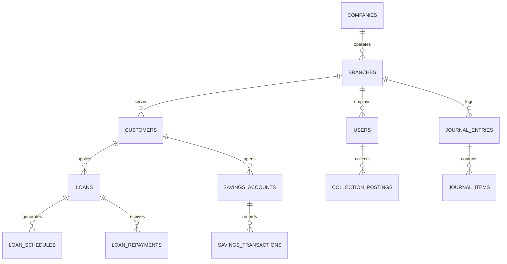

# Database Architecture Specification - TG Microfinance ERP

## Overview
The database architecture for **TG Microfinance ERP** is designed for MySQL 8.0 using the **InnoDB** engine to ensure ACID compliance, foreign key integrity, and precise financial calculations.

---

## Entity Relationship Overview

---

## Core Table Schemas & Fields

### 1. Corporate & Branch Hierarchy
- **`companies`**: `id`, `name`, `code`, `registration_number`, `tax_id`, `email`, `phone`, `address`, `currency`, `logo_path`, `is_active`, `timestamps`, `deleted_at`.
- **`branches`**: `id`, `company_id`, `name`, `code`, `manager_id`, `email`, `phone`, `address`, `city`, `state`, `vault_balance` (decimal 18,4), `is_active`, `timestamps`, `deleted_at`.

### 2. Staff Authentication & Employees
- **`users`**: `id`, `company_id`, `branch_id`, `name`, `email`, `email_verified_at`, `password`, `role` (enum), `is_active`, `remember_token`, `timestamps`, `deleted_at`.
- **`employees`**: `id`, `user_id`, `branch_id`, `employee_code`, `first_name`, `last_name`, `designation`, `phone`, `date_of_joining`, `salary` (decimal 18,4), `status`, `timestamps`, `deleted_at`.

### 3. Customer Management
- **`customers`**: `id`, `branch_id`, `customer_number`, `first_name`, `last_name`, `identity_type`, `identity_number`, `gender`, `dob`, `phone`, `email`, `address`, `assigned_officer_id`, `status`, `timestamps`, `deleted_at`.
- **`customer_kyc`**: `id`, `customer_id`, `document_type`, `document_number`, `file_path`, `verified_by`, `verified_at`, `timestamps`.
- **`guarantors`**: `id`, `customer_id`, `name`, `identity_number`, `phone`, `address`, `relationship`, `timestamps`.

### 4. Loan Engine & Portfolio
- **`loan_products`**: `id`, `name`, `code`, `interest_rate` (decimal 8,4), `interest_type` (flat, reducing), `repayment_frequency` (weekly, monthly), `min_amount`, `max_amount`, `min_tenure`, `max_tenure`, `penalty_rate`, `is_active`, `timestamps`.
- **`loans`**: `id`, `branch_id`, `customer_id`, `loan_product_id`, `loan_account_number`, `principal_amount` (decimal 18,4), `interest_rate`, `tenure_months`, `disbursed_at`, `disbursed_by`, `status` (pending, approved, disbursed, closed, defaulted), `approved_by`, `timestamps`, `deleted_at`.
- **`loan_schedules`**: `id`, `loan_id`, `installment_number`, `due_date`, `principal_due` (decimal 18,4), `interest_due` (decimal 18,4), `penalty_due`, `principal_paid`, `interest_paid`, `status` (unpaid, partial, paid, overdue), `timestamps`.
- **`loan_repayments`**: `id`, `loan_id`, `loan_schedule_id`, `receipt_number`, `amount_paid` (decimal 18,4), `principal_component`, `interest_component`, `penalty_component`, `payment_method`, `collected_by`, `posted_at`, `timestamps`.

### 5. Savings Scheme
- **`savings_products`**: `id`, `name`, `code`, `interest_rate_per_annum` (decimal 8,4), `min_opening_balance`, `allow_withdrawals`, `is_active`, `timestamps`.
- **`savings_accounts`**: `id`, `branch_id`, `customer_id`, `savings_product_id`, `account_number`, `current_balance` (decimal 18,4), `status`, `opened_at`, `timestamps`, `deleted_at`.
- **`savings_transactions`**: `id`, `savings_account_id`, `transaction_type` (deposit, withdrawal, interest_credit), `amount` (decimal 18,4), `balance_after` (decimal 18,4), `reference_number`, `processed_by`, `timestamps`.

### 6. Daily Field Collections
- **`collection_sheets`**: `id`, `branch_id`, `officer_id`, `sheet_date`, `route_name`, `total_expected`, `total_collected`, `status`, `timestamps`.
- **`collection_postings`**: `id`, `collection_sheet_id`, `customer_id`, `loan_id`, `amount_collected`, `receipt_number`, `posted_by`, `timestamps`.

### 7. Financial Accounting & General Ledger
- **`chart_of_accounts`**: `id`, `company_id`, `account_code`, `account_name`, `account_type` (asset, liability, equity, revenue, expense), `parent_id`, `balance` (decimal 18,4), `is_active`, `timestamps`.
- **`journal_entries`**: `id`, `branch_id`, `voucher_number`, `entry_date`, `description`, `posted_by`, `status`, `timestamps`.
- **`journal_items`**: `id`, `journal_entry_id`, `account_id`, `debit` (decimal 18,4), `credit` (decimal 18,4), `timestamps`.

### 8. System, Audit & Website CMS
- **`system_settings`**: `id`, `key`, `value`, `group`, `timestamps`.
- **`audit_logs`**: `id`, `user_id`, `event`, `auditable_type`, `auditable_id`, `old_values` (json), `new_values` (json), `ip_address`, `timestamps`.
- **`loan_applications`**: `id`, `applicant_name`, `phone`, `email`, `requested_amount`, `branch_id`, `status`, `timestamps`.

---

## Data Precision & Financial Integrity
1. **Decimal Precision**: All currency and financial balances use `DECIMAL(18,4)` to eliminate floating-point rounding errors.
2. **Transactional Safety**: Financial operations (Disbursements, Repayments, Ledger Postings) execute within `DB::transaction()` blocks.
3. **Soft Deletes**: Critical entities (`branches`, `employees`, `customers`, `loans`, `savings_accounts`) implement `softDeletes()` to prevent accidental data loss.
