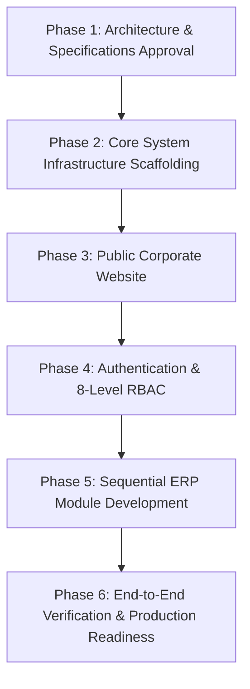

# TG Microfinance ERP - Master Implementation Plan

## Executive Summary
This document provides the master implementation blueprint for building **TG Microfinance ERP**, a production-ready enterprise Microfinance ERP integrated with a public corporate website in a single **Laravel 12 (PHP 8.2)** codebase.

---

## Key Constraints & Governance Rules
1. **No Code Generation Pre-Approval**: All architectural and documentation specs must be explicitly reviewed and approved prior to code execution.
2. **Module-by-Module Execution**: Each module will be developed, tested, and verified sequentially.
3. **PSR-12 Compliance**: All PHP code must adhere strictly to PSR-12 coding standard and single-responsibility principles.
4. **Clean Architecture**: Domain business logic, application services, presentation controllers, and data storage infrastructure must remain decoupled.
5. **No Shortcuts**: Every feature must include strict validation, transactional integrity, soft deletes, audit logging, and responsive UI.

---

## Phased Implementation Roadmap

### Phase 1: Architecture & Specifications (Current Phase)
- Generate core documentation: `implementation_plan.md`, `system_architecture.md`, `database_architecture.md`, `folder_structure.md`, `ui_roadmap.md`, `module_roadmap.md`.
- Obtain formal architecture approval from project owner.

### Phase 2: Core System Infrastructure Scaffolding
- Basic route skeleton setup (`routes/public.php`, `routes/auth.php`, `routes/admin.php`).
- Domain folder namespace declaration (`App\Domain\*`).
- Service Providers, base middleware (`RoleMiddleware`, `BranchScopeMiddleware`, `AuditTrailMiddleware`), and error handlers.

### Phase 3: Public Corporate Website
- Shared Bootstrap 5 public layout template with SEO tags & responsive navigation.
- 12 website pages: Home, About, Services, Loan Products, Savings Products, Branches, Gallery, Downloads, FAQ, Career, Contact, Apply Loan.

### Phase 4: Authentication & RBAC Security Framework
- Staff Login portal (`/login`).
- 8-level Role-Based Access Control matrix (`Super Admin`, `Company Admin`, `Branch Manager`, `Loan Officer`, `Collection Officer`, `Cashier`, `Accountant`, `Auditor`).

### Phase 5: Modular ERP System Implementation (One-by-One)
1. **Company Module** (Head Office configuration, organization hierarchy)
2. **Branch Module** (Branch management, location data, vault limits)
3. **Employee Module** (Staff onboarding, role assignment, branch designation)
4. **Customer Module** (KYC documents, borrower profiles, savings members)
5. **Loan Module** (Loan products, interest engines, approval workflows, schedule generators)
6. **Savings Module** (Deposit schemes, passbooks, withdrawals, interest accruals)
7. **Collection Module** (Daily collection sheets, officer field assignments, postings)
8. **Accounting Module** (Chart of Accounts, journal vouchers, General Ledger)
9. **Reports Module** (Portfolio at Risk (PAR), collection variance, financial balance sheet)
10. **Settings Module** (System parameters, audit trails, database backup triggers)
11. **Dashboard Module** (Executive analytics, real-time KPI widgets)

---

## Verification Plan

### Automated Verification
- PSR-12 linting (`vendor/bin/pint --test`).
- Route verification (`php artisan route:list`).
- Unit & Integration testing (`php artisan test`).

### Manual Verification
- Layout responsiveness audit across viewport sizes.
- Role-permission access boundary check for all 8 roles.
- Financial calculation accuracy (loan interest, schedule rounding, trial balance zero-sum).
