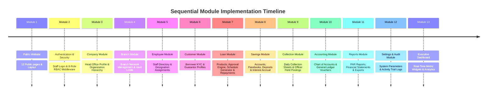

# Module Execution Roadmap - TG Microfinance ERP

## Overview
This document specifies the sequential execution plan for implementing each module in **TG Microfinance ERP**. Development will strictly proceed **one module at a time**, requiring explicit verification and approval before initiating the next.

---

## Sequential Execution Timeline

---

## Module-by-Module Specifications

### Module 1: Public Corporate Website
- **Scope**: 12 Public pages (`Home`, `About`, `Services`, `Loan Products`, `Savings Products`, `Branches`, `Gallery`, `Downloads`, `FAQ`, `Career`, `Contact`, `Apply Loan`).
- **Features**: Interactive loan calculator, online inquiry forms, branch location finder, responsive Bootstrap 5 styling.
- **Verification**: All 12 page routes load cleanly, responsive across devices, SEO meta tags present.

### Module 2: Authentication & RBAC Security
- **Scope**: `/login`, `/logout`, role permissions, branch scoping middleware.
- **Features**: 8 user roles (`Super Admin`, `Company Admin`, `Branch Manager`, `Loan Officer`, `Collection Officer`, `Cashier`, `Accountant`, `Auditor`).
- **Verification**: Unauthenticated users redirected to `/login`, role boundaries enforced, session branch context initialized.

### Module 3: Company Module
- **Scope**: Head Office profile, legal registration details, tax identifiers, base currency configuration.
- **Features**: CRUD company profiles, logo upload, organization hierarchy setup.
- **Verification**: Validated company record saved, base currency propagated to system configs.

### Module 4: Branch Module
- **Scope**: Branch creation, location code assignment, vault balance tracking, branch manager assignment.
- **Features**: CRUD branches, vault cash limits, active status toggle.
- **Verification**: Branch records created, vault limits enforced in transaction middleware.

### Module 5: Employee Module
- **Scope**: Staff onboarding, employee IDs, branch assignment, role binding.
- **Features**: Employee profiles, contact info, status management (Active, Suspended, Resigned).
- **Verification**: Staff tied to valid branch and user role; employee directory filterable by branch.

### Module 6: Customer Module
- **Scope**: Customer / Member onboarding, KYC document uploads, guarantor registration.
- **Features**: Customer identification numbers, ID proof uploads, loan officer assignment.
- **Verification**: Unique customer code auto-generated, required KYC documents validated.

### Module 7: Loan Module (Core Engine)
- **Scope**: Loan product definitions, loan application processing, approval/rejection workflows, installment schedule generator, disbursement, repayment processing, collateral records.
- **Features**: Flat vs. Reducing interest calculation algorithms, penalty rules, repayment receipts.
- **Verification**: Accurate schedule principal/interest split, zero rounding error, automated status transitions (`Pending` $\rightarrow$ `Approved` $\rightarrow$ `Disbursed` $\rightarrow$ `Closed`).

### Module 8: Savings Module
- **Scope**: Savings schemes, account opening, cash deposit, withdrawal, interest accrual.
- **Features**: Passbook generation, minimum balance validation, transaction history logs.
- **Verification**: Vault debit/credit check on deposits and withdrawals, accurate interest credit.

### Module 9: Collection Module
- **Scope**: Daily collection sheet creation, route officer assignment, field posting.
- **Features**: Real-time receipt matching, collection variance tracking.
- **Verification**: Collection postings update loan repayments and cashier vault balances atomically.

### Module 10: Accounting Module
- **Scope**: Double-entry bookkeeping system, Chart of Accounts, Journal Vouchers, General Ledger, Trial Balance.
- **Features**: Automatic GL entry generation upon loan disbursement, repayment, and deposit.
- **Verification**: Total debits strictly equal total credits across all posted vouchers.

### Module 11: Reports Module
- **Scope**: Financial and operational reporting engine.
- **Features**: Portfolio At Risk (PAR 30, PAR 60, PAR 90), Collection Efficiency, General Ledger Trial Balance, Profit & Loss.
- **Verification**: Filterable by date range and branch; downloadable formats.

### Module 12: Settings & Audit Module
- **Scope**: System configurations, audit log viewer.
- **Features**: System parameters management, audit trail inspection for auditor compliance.
- **Verification**: All administrative operations logged with IP, user ID, timestamp, and changes diff.

### Module 13: Executive Dashboard Module
- **Scope**: Real-time executive dashboard for high-level management.
- **Features**: Active loan portfolio totals, savings deposit sums, today's collections KPI widgets, PAR chart.
- **Verification**: Metrics reflect branch context or aggregated enterprise values based on role permissions.

---

## Governance Rule per Module
Before starting implementation on any module:
1. Obtain user confirmation for that specific module.
2. Build migrations, models, repositories, application services, controllers, and Blade views for that module.
3. Test and verify the module.
4. Obtain user approval before moving to the next module.
