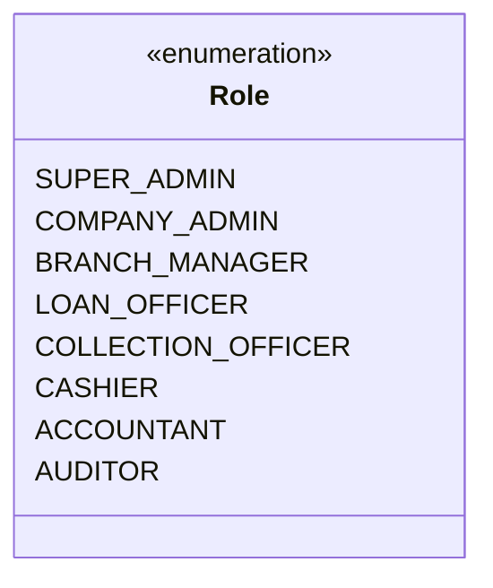

# System Architecture Specification - TG Microfinance ERP

## Overview
**TG Microfinance ERP** is architected as an enterprise-grade monolith using **Laravel 12 (PHP 8.2)**. It features a strict **Clean Architecture / Domain-Driven Design (DDD)** structure that clearly segregates public web presentation from core financial ERP operations.

---

## Architectural Layers

```mermaid
graph TD
    subgraph Client Layer
        WebUser[Public Website Visitor]
        StaffUser[Staff Member / Admin]
    end

    subgraph Presentation Layer / Delivery (Http)
        PublicControllers[Public Website Controllers]
        AdminControllers[Admin ERP Controllers]
        Middlewares[Auth, RBAC, Branch Scope, Audit Trail Middlewares]
    end

    subgraph Application Service Layer
        AppServices[Application Services & DTO Orchestration]
    end

    subgraph Clean Domain Core (App/Domain)
        DomainModels[Domain Entities & Enums]
        DomainServices[Interest Engines, Ledger Calculators, Schedule Generators]
        DomainContracts[Repository Interfaces & Service Contracts]
    end

    subgraph Infrastructure / Storage Layer
        EloquentRepos[Eloquent Repository Implementations]
        MySQL[(MySQL Database)]
    end

    WebUser --> PublicControllers
    StaffUser --> Middlewares
    Middlewares --> AdminControllers
    PublicControllers --> AppServices
    AdminControllers --> AppServices
    AppServices --> DomainServices
    DomainServices --> DomainContracts
    DomainContracts --> EloquentRepos
    EloquentRepos --> MySQL
```

### 1. Presentation Layer (`app/Http/`)
- **Controllers**: Thin controllers responsible only for receiving requests, invoking Application Services or Repositories, and returning Blade views or HTTP responses.
  - `App/Http/Controllers/Public/`: Serves unauthenticated corporate website pages.
  - `App/Http/Controllers/Admin/`: Serves protected ERP management modules.
  - `App/Http/Controllers/Auth/`: Manages staff authentication and session management.
- **Middleware**: Intercepts request pipelines to enforce security rules:
  - `RoleMiddleware`: Verifies staff roles against the required module permissions.
  - `BranchScopeMiddleware`: Injects the active branch scope into the session/query context.
  - `AuditTrailMiddleware`: Records mutating requests (POST, PUT, DELETE) for compliance auditing.

### 2. Application Service Layer (`app/Domain/*/Services`)
- Orchestrates multi-domain operations (e.g., approving a loan triggers schedule generation, vault debit/credit, and GL journal posting).
- Utilizes Data Transfer Objects (DTOs) to ensure type safety between controllers and domain logic.

### 3. Domain Core Layer (`app/Domain/*`)
- Houses immutable business logic, financial algorithms (Flat rate, Reducing balance interest calculations, Penalty formulas), and Domain Entities.
- Pure PHP classes devoid of HTTP or framework-specific dependencies.

### 4. Infrastructure & Data Access (`database/` & Repositories)
- Implements Repository contracts using Eloquent models.
- Handles database transactions (`DB::transaction()`), locks, index optimizations, and soft deletes.

---

## Security Architecture

### Role-Based Access Control (RBAC) Matrix



- **Super Admin**: System-wide administrative privileges across all companies and branches.
- **Company Admin**: Multi-branch operational management, employee creation, and corporate settings.
- **Branch Manager**: Branch-level supervision, loan approval/rejection, daily collection reconciliation.
- **Loan Officer**: Customer onboarding, loan application processing, repayment schedule tracking.
- **Collection Officer**: Field collection sheet posting, mobile collection logging.
- **Cashier**: Counter operations, loan disbursements, cash deposits, manual withdrawals.
- **Accountant**: Financial chart of accounts, journal entries, trial balance generation, tax/fee vouchers.
- **Auditor**: Read-only read access across all ERP data tables and audit trail logs.

### Multi-Branch Data Isolation
- Data models containing `branch_id` enforce a global `BranchScope` for users with branch-specific roles (`Branch Manager`, `Loan Officer`, `Cashier`, `Collection Officer`).
- Users with global roles (`Super Admin`, `Company Admin`, `Auditor`) can toggle branch filters or view consolidated enterprise metrics.

---

## Technical Standards
- **PHP Version**: 8.2+ with strict typing (`declare(strict_types=1);`).
- **Framework**: Laravel 12.x.
- **Database Engine**: MySQL 8.0+ (InnoDB, UTF8MB4).
- **Code Standard**: PSR-12 enforced via Laravel Pint.
